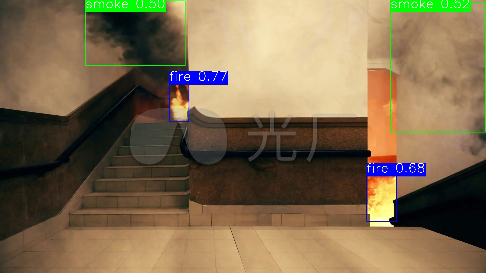

# 1. 简介
基于 YOLOV6，在RK3588上实现的明火烟雾检测模型  
  
[点击查看演示视频](https://live.csdn.net/v/480128)

## 1.1 数据集来源
训练数据集20500张，其中真实数据集约15000张，合成烟雾数据集约5000张，数据集均来源于网上搜集，并进行部分重新标定  
[点击进入数据集参考网址1](https://blog.csdn.net/weixin_41171614/article/details/137613698)  
[点击进入数据集参考网址2](https://universe.roboflow.com/ )  

## 1.2 训练代码及版本
[点击进入YOLOV6源码地址](https://github.com/airockchip/YOLOv6) ，预训练模型及代码版本号选择：**0.3.0**

### 1.1.1 训练命令示例
**Note:** 注意训练适配 rknn 的模型时，不要开启 ***--fuse_ab***
```shell
python tools/train.py --batch 32 --epochs 100 --conf configs/yolov6n_finetune.py --data data/dataset.yaml  --device 0
``` 

### 1.1.2 测试训练后的模型效果
```shell
python tools/infer.py --weights ./weights/last_ckpt.pt --yaml ./data/dataset.yaml --source ./test_data/img/ --save-dir ./test_data/results/
``` 

### 1.1.3 查看训练loss曲线示例
```shell
tensorboard --logdir ./runs/train/exp/
```

### 1.1.4 导出适配rknn的onnx模型示例
```shell
python deploy/RKNN/export_onnx_for_rknn.py --weight ./yolov6n.pt
```

### 1.1.5 导出rknn模型
[导出教程参考 rknn_model_zoo](https://github.com/airockchip/rknn_model_zoo)
## 1.3 版本说明

| 版本号   | 日期       | 功能说明                           |
|----------|------------|------------------------------------|
| v1.0.0   | 2025-06-01 | 支持图片/本地视频流火焰烟雾检测     |


## 1.4 模型评估
<table border="1">
  <tr>
    <th>模型</th>
    <th>召回率</th>
    <th>误检率</th>
  </tr>
  <tr>
    <td>yolov6sInt8.rknn</td>
    <td>95%</td>
    <td>/</td>
  </tr>
</table>  

[名词解释]           
- 图片级别召回：只要在有目标的图片上检测出目标（不论框的个数），该图片被认为召回
- 图片级别误检：只要在无目标的图片上检测出目标（不论框的个数），该图片被认为误检

# 2. 使用
## 2.1 编译项目
```shell
cmake -S . -B build && cmake --build build
```

## 2.2 执行
./build/main <rknn_model_path> <input_data_dir> <input_type> [save_video]

**参数说明:**  
<rknn_model_path>：RKNN 模型文件路径（如：./weights/yolox_ss_fire_fp.rknn）  
<input_data_dir>：输入图像或视频所在目录（如：./test_data/）  
<input_type>：img：输入为图像；video：输入为视频  
[save_video]（可选）：仅video模式需要，用于保存推理结果视频（输入任意字符即可保存）  

执行推理后的图片/视频结果会放到工作目录的`results`目录下

**示例:**
```shell
./build/main ./weights/300_epoch_v6s_int8.rknn ./test_data/ img
./build/main ./weights/300_epoch_v6s_int8.rknn ./test_data/ video 1
```

# 3. 后续规划
当前版本只是较为基础的版本，后续将集成其他安防模型（如：安全帽、人员倒地检测模型），并集成8路以上摄像头进行实时视频检测, 每路摄像头都将检测若干个模型。